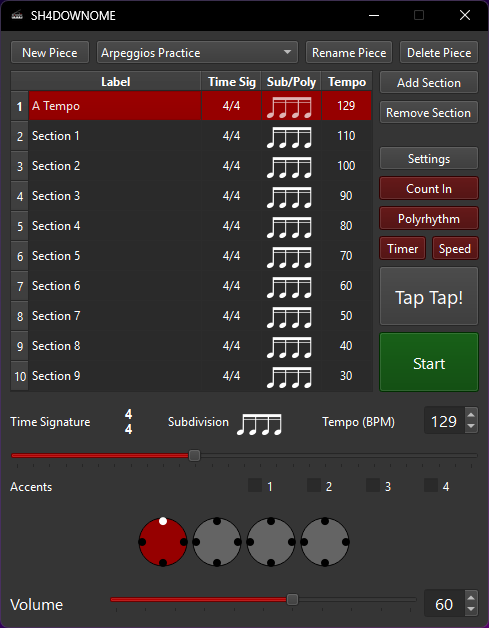
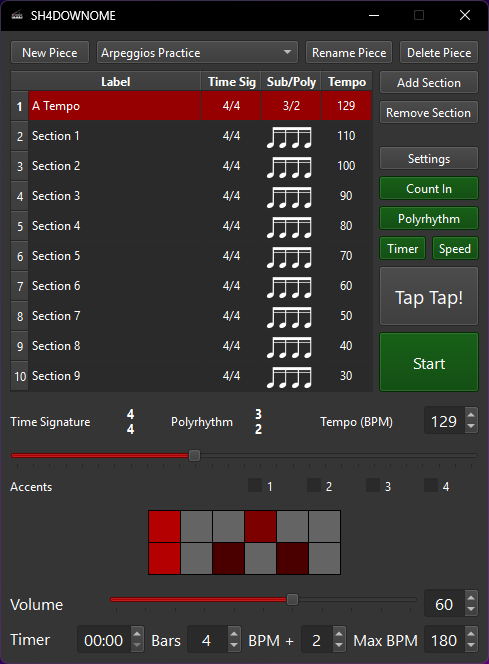

# SH4DOWNOME
Metronome App with Polyrhythm support for Windows Built in C++

- You can hide the window (OBS Beat) in the settings of the metronome, it's default to show upon first use.
- Change sections with Arrow Keys.
- Move sections with CTRL + Arrow Keys.
- Rename Sections by double clicking the section text.
- To change Time Signature and Subdivision, click the icons/text that's below the section area, they're to the left of the tempo spin box, or above the the tempo slider.
- The rest should be pretty self explanatory.

