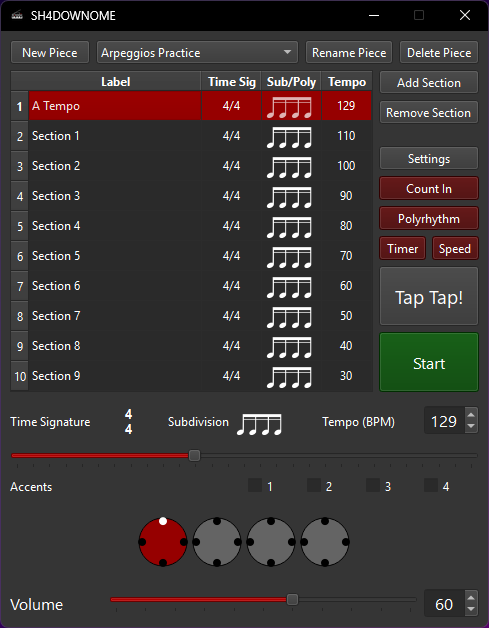
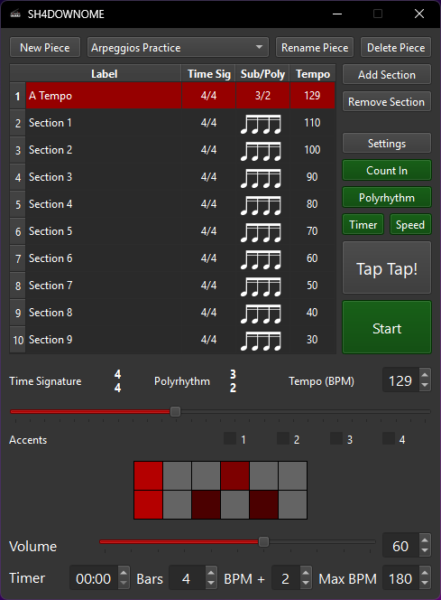

# SH4DOWNOME

A feature-packed, portable metronome application for Windows, built with Qt 6.

 &nbsp; 

---

## Features

### Core Playback
- **Precise audio engine** — sub-sample accurate pulse scheduling via [miniaudio](https://github.com/mackron/miniaudio) (no DLLs)
- **Tap Tempo** — tap to set the BPM in real time
- **Count-in** — configurable lead-in before playback begins
- **Timer** — built-in countdown timer
- **Speed Trainer** — automatically ramps tempo up or down across bars

### Rhythm & Notation
- **Time Signatures** — configurable numerator and denominator, with compound time support
- **Subdivisions** — extensive library covering standard, dotted, triplet, quintuplet, septuplet, duplet, and quadruplet patterns
- **Custom Subdivision Editor** — build your own patterns with drag-to-reorder pulse tiles, rest/accent toggles, tuplet brackets, and undo support
- **Polyrhythm** — overlay a secondary rhythm against the primary beat (e.g. 3:2, 5:4, 7:3) with quick-select presets
- **Accent Beats** — individually toggle accents per beat in any time signature
- **SVG Note Rendering** — subdivision patterns displayed as accurate music notation

### Organisation
- **Pieces & Sections** — save named pieces, each with unlimited sections
- **Per-section settings** — tempo, time signature, subdivision, accents, and polyrhythm stored per section
- **Section reordering** — drag or use keyboard shortcuts to rearrange sections
- **Inline rename** — double-click a section label to rename it
- **JSON persistence** — presets saved to `presets.json` for easy portability

### Interface & Extras
- **Beat Indicator** — visual dots for beats and subdivisions; switches to an LCM grid in polyrhythm mode
- **OBS Beat Window** — detachable overlay showing tempo, beat flash, and notation; ideal for streaming/recording capture
- **Always on Top** — keep the window visible over other applications
- **Colour Personalisation** — choose a custom accent colour throughout the UI
- **Multiple Click Sounds** — select from different sound sets in settings
- **Keyboard-driven** — start/stop, section navigation, and more without touching the mouse

---

## Keyboard Shortcuts

| Shortcut | Action |
|---|---|
| `Space` | Start / Stop |
| `↑` / `↓` | Select previous / next section |
| `Ctrl+↑` / `Ctrl+↓` | Move selected section up / down |
| `Double-click section label` | Rename section |
| `Ctrl+Z` *(Custom Subdivision Editor)* | Undo last pulse edit |

---

## Installation

SH4DOWNOME is fully portable — no installer required.

1. Download the latest release `.zip` from the [Releases](../../releases) page.
2. Extract the contents to any folder.
3. Run `SH4DOWNOME.exe`.

> **Migrating from a previous version:** copy your `presets.json` file from the old folder into the new folder to keep all your saved pieces and sections.

---

## Building from Source

**Requirements**
- [Qt 6.9.1](https://www.qt.io/download) (MinGW 64-bit recommended on Windows)
- CMake ≥ 3.16
- C++17 compatible compiler

**Steps**

```bash
git clone https://github.com/your-username/SH4DOWNOME.git
cd SH4DOWNOME
cmake -B build -DCMAKE_BUILD_TYPE=Release
cmake --build build --config Release
```

The resulting binary is statically linked — no Qt or runtime DLLs are needed on the target machine.

---

## Quick Start

1. **Create a piece** — nothing is saved until you create a piece. Hit *New Piece*, give it a name, then add sections as needed.
2. **Add sections** — each section stores its own tempo, time signature, subdivision, and accent pattern.
3. **Navigate sections** — use `↑`/`↓` arrow keys or click in the section list.
4. **Set your tempo** — type directly in the BPM box, drag the slider, or use Tap Tempo.
5. **Choose a subdivision** — click the notation icon to the left of the tempo area to open the Subdivision Selector.
6. **Set time signature** — click the time signature display to change it.
7. **Start / Stop** — press `Space` or click the play button.
8. **OBS Beat Window** — a detachable overlay window opens by default on first run. You can hide it permanently in *Settings*.

---

## Known Issues

- Custom Subdivisions are in an early stage of development and may not always behave as expected.
- Some subdivision notation glyphs can appear slightly misaligned.

---

## Tech Stack

| Component | Technology |
|---|---|
| UI framework | Qt 6 (Widgets, Svg) |
| Audio engine | [miniaudio](https://github.com/mackron/miniaudio) (header-only) |
| Build system | CMake |
| Persistence | JSON (`presets.json`) / `QSettings` |
| Notation rendering | Custom SVG assembler |
