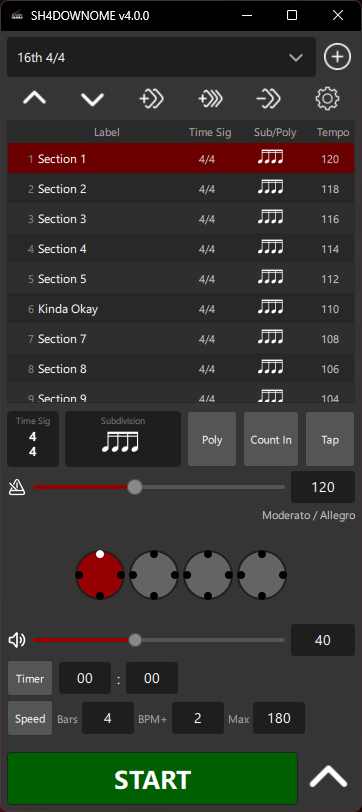
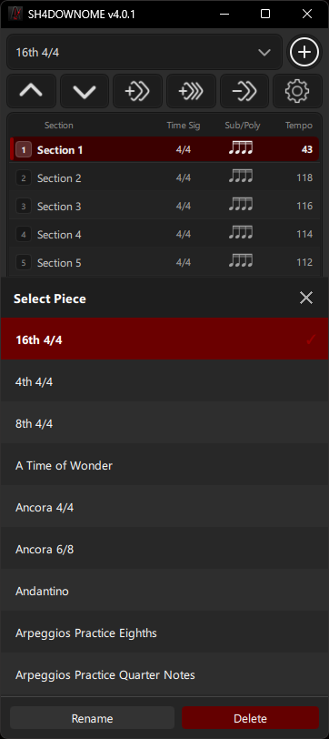
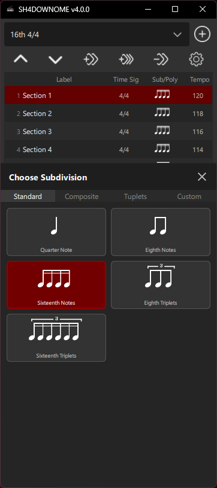
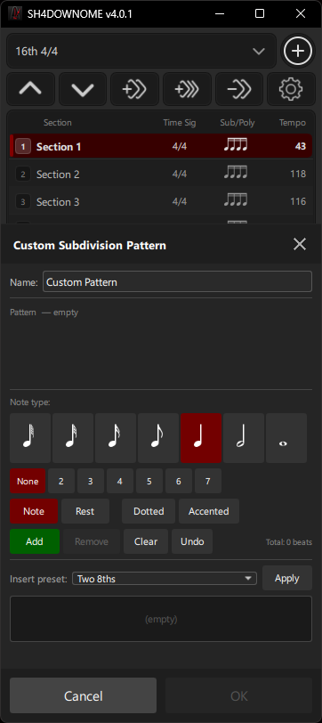
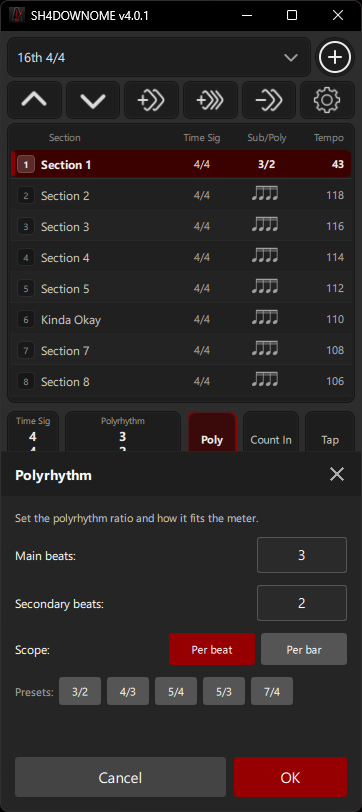
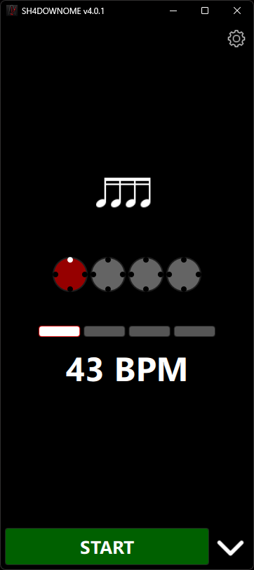
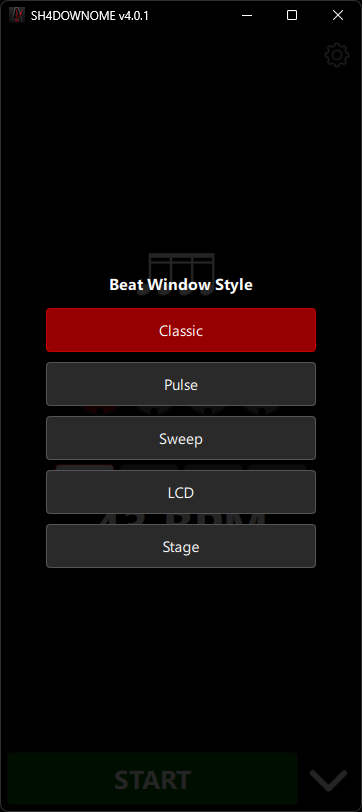
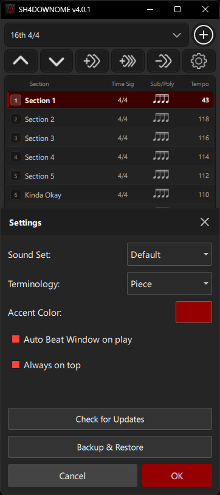

# SH4DOWNOME

SH4DOWNOME is a cross-platform metronome for Windows and Android, built for structured practice, complex subdivisions, polyrhythms, speed training, and stream-friendly visual feedback.

It is designed around pieces and sections: each section can store its own tempo, time signature, subdivision, accents, and polyrhythm settings, making it useful for practice routines, repertoire, lessons, and rhythm studies.

## Screenshots

<p align="center">
  <a href="img/1.png"></a>
  <a href="img/2.png"></a>
  <a href="img/3.png"></a>
  <br>
  <a href="img/4.png"></a>
  <a href="img/5.png"></a>
  <a href="img/6.png"></a>
  <br>
  <a href="img/7.png"></a>
  <a href="img/7.png"></a>
</p>

## Highlights

- Windows and Android builds.
- Responsive interface with separate desktop and touch-friendly Android layouts.
- Sample-scheduled audio playback powered by [miniaudio](https://github.com/mackron/miniaudio).
- Piece and section workflow for structured practice.
- Standard, compound, tuplet, dotted, and custom subdivisions.
- Polyrhythm support with per-beat and per-bar behavior.
- Speed trainer, countdown timer, count-in, tap tempo, and accent controls.
- Detachable Beat Window for OBS, recording, streaming, or second-screen use.
- Multiple click sound sets, including Woodblock 2.

## Features

### Practice Workflow

- Create named pieces and organize them into sections.
- Store tempo, time signature, subdivision, accents, and polyrhythm per section.
- Add, remove, rename, reorder, and navigate sections quickly.
- Use bulk section creation for tempo-ramp practice setups.
- Save presets automatically to `presets.json`.
- Import/export presets and custom subdivision patterns.

### Rhythm Tools

- Time signatures with simple and compound meter support.
- Accent toggles per beat.
- Built-in subdivision library covering common note values and tuplets.
- Custom subdivision editor for building your own pulse patterns.
- Rests and accents inside custom subdivision patterns.
- SVG-based notation rendering for subdivision display.
- Polyrhythm mode for ratios such as 3:2, 5:4, and other custom pairings.
- Per-beat and per-bar polyrhythm scope options.

### Playback Tools

- Tap tempo.
- Count-in.
- Countdown timer.
- Speed trainer with bars-per-step, BPM increment, and maximum BPM controls.
- Multiple click sound sets:
  - Default
  - Woodblock
  - Wooden
  - Woodblock 2
  - Bongo
  - Cowbell
  - Digital
  - Drum
  - Hihat
  - Metal

### Interface

- Desktop layout with a compact section table and dense controls.
- Android layout rebuilt for smaller screens and touch interaction.
- Large transport controls on Android.
- Android-friendly text and number input handling.
- Custom accent color.
- Always-on-top support on desktop platforms.
- Keyboard-driven desktop workflow.

### Beat Window

The Beat Window is a detachable visual display intended for OBS, recording, streaming, or focused practice.

It includes several visual styles:

- Classic
- Pulse
- Sweep
- LCD
- Stage
- Polyrhythm

The Beat Window can show tempo, beat position, subdivision relationship, polyrhythm grids, and timer remaining. Available visual styles are filtered depending on whether the current section is using normal rhythm or polyrhythm mode.

## Keyboard Shortcuts

| Shortcut | Action |
|---|---|
| `Space` | Start / stop |
| `Up` / `Down` | Select previous / next section |
| `Ctrl+Up` / `Ctrl+Down` | Move selected section up / down |
| Double-click section label | Rename section |

## Installation

Download the latest build from the [Releases](../../releases) page.

### Windows

1. Download the Windows release package.
2. Extract it to any folder.
3. Run `SH4DOWNOME.exe`.

### Android

1. Download the APK for your device architecture.
2. Transfer it to your Android device if needed.
3. Open the APK and allow installation when prompted.

The Android APKs currently provided are debug builds and are not release-signed. Android may warn that the app is from an unknown source, built for testing, or requires confirmation from Play Protect/package installer. These warnings are expected for the current APKs.

## Data Storage

SH4DOWNOME stores user data in the app data location provided by Qt.

- Pieces, sections, presets, and custom subdivision patterns are stored in `presets.json`.
- App preferences are stored in `settings.ini`.

The exact folder depends on the operating system. On Windows this is typically under the user's AppData location.

## Building From Source

### Requirements

- Qt 6.11.1
- CMake 3.16 or newer
- C++17 compatible compiler
- MinGW 64-bit toolchain for Windows builds
- Android SDK/NDK for Android builds

For Android packaging with the current Qt 6.11.1 setup:

- Android SDK Platform 36 is required.
- Android compile SDK is set to 36.
- Minimum Android SDK is 26.
- Target Android SDK is 34.

### Basic Build

```bash
git clone https://github.com/SH4DOWSIX/SH4DOWNOME.git
cd SH4DOWNOME
cmake -B build -DCMAKE_BUILD_TYPE=Release
cmake --build build --config Release
```

Qt Creator is recommended for Android builds because it handles the Qt Android kit, ABI selection, deployment JSON, and `androiddeployqt` packaging workflow.

## Notes

- Android Java deprecation warnings may appear during packaging. These do not currently block builds.
- Qt Creator may show a QML import warning for `com.sh4downome`; this can be an IDE/import-scanner warning rather than a runtime failure.
- Very long custom subdivision patterns can become visually dense in some Beat Window styles.

## Tech Stack

| Component | Technology |
|---|---|
| UI | Qt 6 / QML / Qt Quick Controls |
| Native dialogs and helpers | C++ / Qt |
| Audio | miniaudio |
| Build system | CMake |
| Persistence | JSON and QSettings |
| Notation rendering | Custom SVG assembler |
| Android packaging | androiddeployqt / Gradle |

## License

This project is licensed under the [GNU General Public License v3.0](LICENSE).
